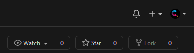

**Special Note:**
This repo is to be used as practice getting use to a GitHub workflow. To begin working on this repo and trying to find your comfort in a GitHub workflow you should `fork` the repository. 

This is found in the top right of the screen

Selecting this button will give you options asking where you would like to fork the repo.  You can select from your account or any organization you have permission in.  This is different from how a classroom assignment gets distributed.  Make sure to keep that in mind when going through this initial process.

This assignment outlined below is an example of what is given to students (it is not a perfect 1:1 to what students are given).

**Differences from basic**
This version of the assignment uses a more "traditional" folder structure for the java files.  Traditional is wrapped in quotes because it is not as accurate as it could be but that structure is in the advanced versions of the assignment.

This version does not have the "Java" language tag given out by GitHub even though it still has a java file in the project.  This is because the Java file is not in the root it is simply in a folder created and named "src".  This is "corrected" in the advanced version as well.  Even without this tag the repo and project works as intended, though it could take slight more setup depending on the IDE.

# Counting Fierce
>Backstory of assignment here for lore purposes.

## Objectives required to complete
This quest has us working with methods and arrays.  We have a goal to determine various pieces of information about three `int` filled arrays.

### Objective 1 - Creating a project board
Description on how to make a project board, template to select.

### Objective 2 - Designing a Plan 
Description of what is expected in a design plan

### Objective 3 - Cloning
Simple reminder to clone this repo into `IntelliJ` here.

### Objective 4 - Branching from the master
Description of how to branch from the `master` in `IntelliJ`.  Expectation is students have more than one branch when working on projects.  They merge branches into master at the end when submitting only the master branch is graded.

**Note** For this practice I would suggest the following branching as it allows for decent practice. A `dev` branch off of the master.  Then each method gets its own branch off of the `dev`.  As these methods are completed they should be merged to the `dev` for testing.  If the methods test well then merge into the `master`.  You could add a `testing` branch between the method branches and the `dev` depends on how much practice you want to give.  While there are some "standards" to branching each company will have different requirements and ways to do it so practicing and find a flow that works best for you and your students is suggested.

## Quest Requirements

### Objective 1 - The methods
There are several various pieces of information we can pull from an array of numbers.  Doing these methods help us with method writing, array traversal, variable scope, and method calling.

- Sum the elements `sumElems`

- Average the elements `avgElem`

- Count occurences `countOccurs`
	- count the number of occurences in the array of a passed value

- Determine presence or absence of a value `appearsIn`
	- use the `countOccurs` to help
	- result should be `true` or `false`

- Determine first location `firstAppear`
	- find the first index of a passed value

- Find the minimum number `minValue`

- Find the maximum number `maxValue`

- Find the range `rangeValue`
	- use `minValue` and `maxValue` to help

**Bonus**
Find the standard deviation of an array of the following: 600, 470, 170, 430, 300, 280, 389

- Calculated standard deviation rounded to the nearest whole number
- Only outside method you are allowed to call is `Math.sqrt()`
	- no other outside Java methods or methods a "friend" has helped you with

Formula for standard deviation for our purposes is `the square root of the variance`.  The variance is defined as `the average of the squared differences from the mean`.

### Objective 2 - Pushing
Reminder to push code from `IntelliJ` back to GitHub.  Another reminder to merge back into master before making the final push.

#### Grading
|   Points     |   Requirement    |
| :----------: |:---------------- |
| 2            | ZZZ              |
| 2            | YYY              |
| 2            | Bonus correct    |
